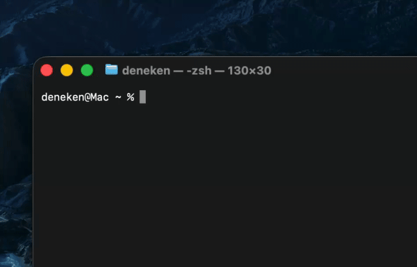

# tdt - Type Don't Think

This tool is great for quick brainstorming, dumping ideas or screaming into the void.

It is a writing tool with a single input area and a visible countdown. Your text only stays visible if you continue typing. When you're done, press `ESC` to go to the review part. 

In review you can look at your text and if you want you can save it ether to the clipboard (by pressing `c`), editing in your terminal editor (by pressing `e` and setting `$EDITOR` in advance) or by piping the output somewhere at the start like this `tdt | cat` or `tdt > myfile.txt`.

After installing use `tdt --help` for some help.



## Install
Install the `tdt` command into your terminal with [uv](https://docs.astral.sh/uv/).

```sh
uv tool install git+https://github.com/udeneken/tdt
```

**For Windows:**
If `tdt` is not recognized after installation, the uv tool bin directory is not available in your current `PATH` yet.

```ps
uv tool update-shell
# $env:Path += ";$(uv tool dir --bin)" # or add to current session
```

## Run
After installing, you can launch it from anywhere with:

```sh
tdt
# tdt --no-review
# tdt --sprint 10 --prompt "Describe the city at dawn"
# tdt -s 5 --show-time
# tdt --help
```

## Usage

Use `--sprint MINUTES` to end the writing session automatically after a fixed writing sprint. The sprint countdown starts with your first input, not when the app opens. By default, countdown and elapsed time displays are hidden from the title bar while the underlying timers stay active. Use `--show-time` to make them visible.

Use `--prompt TEXT` to show a writing prompt above the editor. The prompt is visible during the session but is not included in the exported review text.

Use `--stress none|mid|high` to control how timeout pressure is shown. `mid` is the default behavior, `none` removes the red selection flash and hides expired text immediately, and `high` adds a slight red tint during the last 20% of the delay.

In review mode, `e` exits `tdt` and sends the full review text to `$EDITOR` over stdin. If your editor needs an explicit stdin argument, include it in `$EDITOR`, for example:

```sh
export EDITOR="nvim -"
```

Pipe or redirect the final review text:

```bash
tdt > test.txt
tdt | grep "idea"
tdt | wc -w
```

By default tdt does not echo to terminal. Use `tdt | cat`.
